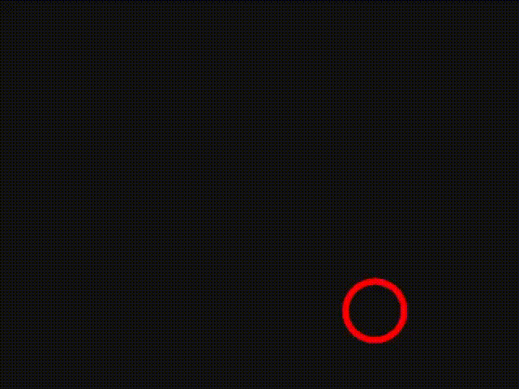

# Subframes

Recreation of Freya Holmer's simulated perception of frame rate differences
using Raylib, as inspired by a video by Tsoding Daily.

**References:**

[Video by @FreyaHolmer](https://x.com/i/status/1795370763421385186)

[Video by @tsoding](https://youtu.be/pnhJ5SDZpGU?si=_0VvdO1F3mT6b6vr)

[Raylib](https://github.com/raysan5/raylib)
